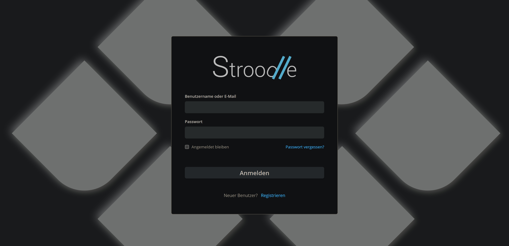
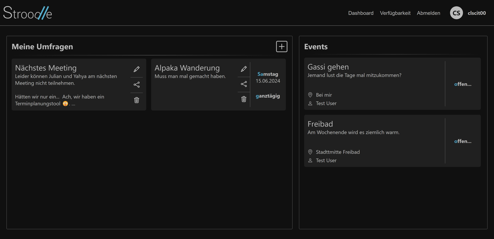
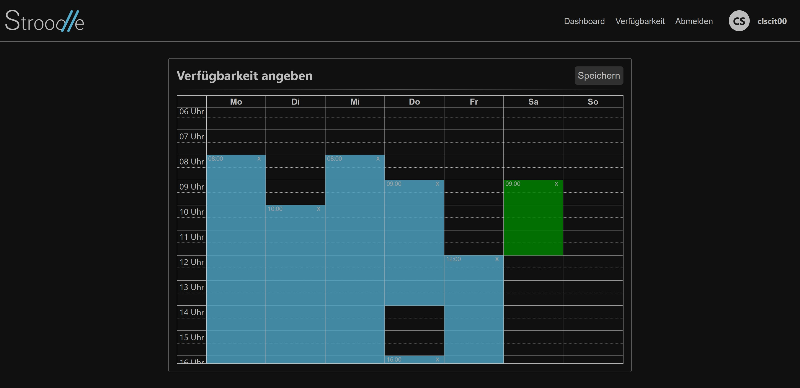
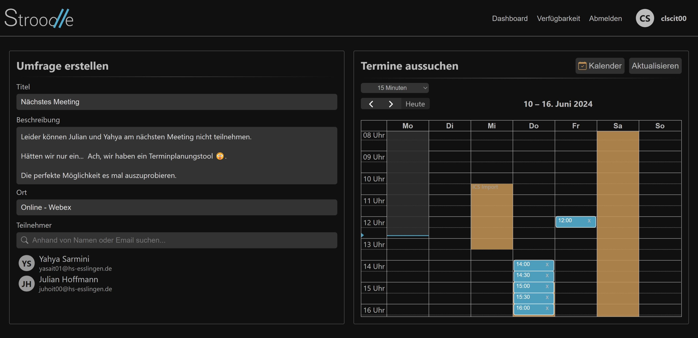
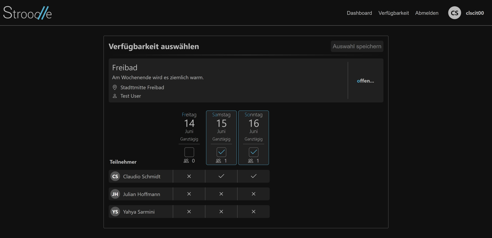
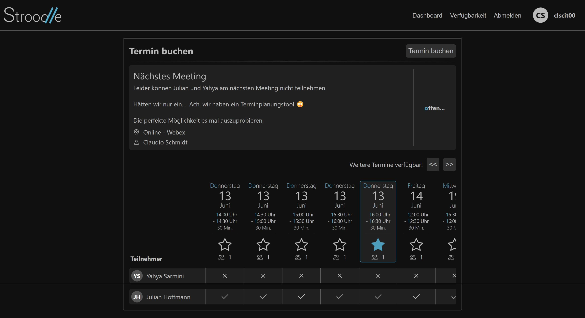
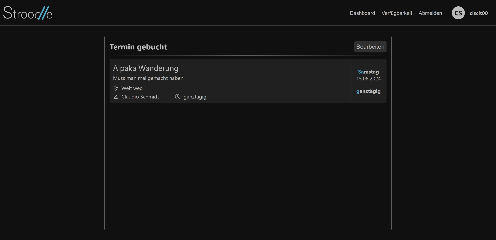
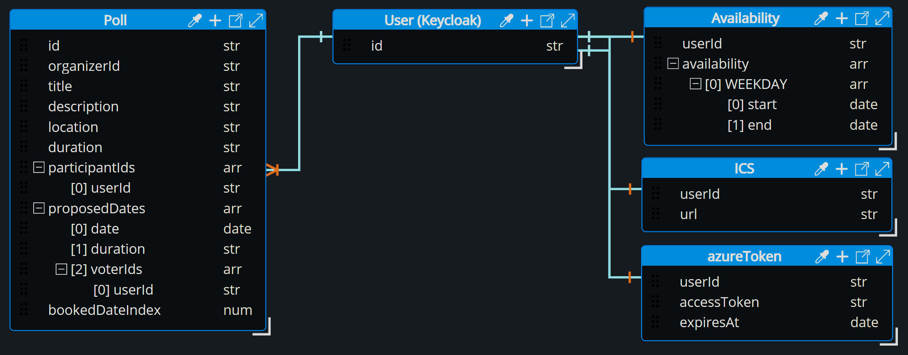

<picture>
  <source srcset="assets/stroodle-logo-white.png" media="(prefers-color-scheme: dark)">
  
</picture>

<p align="center">
  <b>The Scheduling Solution for Teams and Individuals</b>
</p>

## Table of Contents 
1. [Project Overview](#project-overview)
    - [Introduction](#introduction)
    - [Key Features](#key-features)
    - [Purpose and Use Cases](#purpose-and-use-cases)
2. [Interface and Usage](#interface-and-usage)
    - [Login](#login)
    - [Dashboard](#dashboard)
    - [Availability](#availability)
    - [Poll Creation](#poll-creation)
    - [Participant View](#participant-view)
    - [Organizer View](#organizer-view)
3. [Technology Stack](#technology-stack)
    - [Backend](#backend)
        - [Spring Boot](#spring-boot)
        - [Dependencies](#dependencies)
    - [Frontend](#frontend)
        - [React TypeScript](#react-typescript)
        - [Dependencies](#dependencies-1)
    - [Database](#database)
4. [Getting Started](#getting-started)
    - [Prerequisites](#prerequisites)
    - [Installation](#installation)
    - [Running the Application](#running-the-application)
5. [API Documentation](#api-documentation)
    - [API Overview](#api-overview)
        - [User API](#user-api)
        - [Poll API](#poll-api)
        - [Availability API](#availability-api)
        - [ICS API](#ics-api)
        - [Auth API](#auth-api)
        - [Outlook API](#outlook-api)
        - [Email API](#email-api)
    - [API Testing](#api-testing)
        - [Obtaining JWT Token](#obtaining-jwt-token)
        - [Swagger](#swagger)
6. [Database Schema](#database-schema)
    - [ER Diagram](#er-diagram)
    - [Table Descriptions](#table-descriptions)
       - [Poll](#poll)
       - [Availability](#availability)
       - [ICS](#ics)
       - [AzureToken](#azuretoken)
7. [Docker Setup](#docker-setup)
    - [Introduction](#introduction)
    - [Docker Compose](#docker-compose)
    - [Dockerfiles](#dockerfiles)
    - [Running the Application with Docker](#running-the-application-with-docker)
    - [Common Docker Commands](#common-docker-commands)
8. [Testing](#testing)
    - [Frontend Testing](#frontend-testing)
        - [Manual Testing](#manual-testing)
    - [Backend Testing](#backend-testing)
        - [Unit Tests](#unit-tests)
        - [Integration Tests](#integration-tests)
9. [Deployment](#deployment)
    - [Providers](#providers)
       - [bwCloud](#bwcloud)
       - [IONOS](#ionos)
    - [Setup](#setup)
       - [Cloud VM's](#cloud-vms)
       - [Proxy](#proxy)
10. [CI/CD Pipeline](#cicd-pipeline)
    - [Overview](#overview)
    - [Continuous Deployment](#continuous-deployment)
    - [Continuous Integration](#continuous-integration)

## Project Overview 
<a name="project-overview"></a>

### Introduction

**Stroodle** is a web application for scheduling appointments. It allows users to create polls for potential meeting times and invite multiple participants to vote on the proposed times. This helps determine the best time for a meeting when most participants are available.

### Key Features

- **Create Polls:** Create polls for possible meeting times and invite multiple users to participate.
- **Set Availability:** Participants can specify their availability in a weekly view from Monday to Sunday, selecting time slots when they are available.
- **Calendar Integration:** Connect your calendar via an ICS link to see your existing appointments when selecting meeting times, ensuring you choose a time that works for you.

### Purpose and Use Cases

The primary purpose of Stroodle is to simplify the process of scheduling meetings and events with multiple participants. It is especially useful in following scenarios:

- **Team Meetings:** Scheduling regular team meetings where availability of all members varies.
- **Client Appointments:** Coordinating meeting times with clients who have busy schedules.
- **Event Planning:** Organizing events such as workshops, seminars, or social gatherings where participants need to agree on a suitable date and time.
- **Personal Events:** Planning personal events like family gatherings, outings with friends, or community events where participants need to agree on a common time.

By providing a clear view of everyone's availability and integrating with personal calendars, Stroodle ensures that scheduling conflicts are minimized and meetings are set at the most convenient times for all participants.

## Interface and Usage

### Login



When you open Stroodle, you'll see the login screen where you can either log in with your existing account or sign up for a new account.

### Dashboard



The dashboard provides an overview of your organized polls on the left and the polls you are invited to on the right. Each poll card displays the most important information, including the title and description for your polls, and the organizer, location, and meeting duration for the polls you are invited to. You can edit, share, and delete your polls using the corresponding buttons on each poll you have created.

### Availability



When clicking on Availability in the navigation bar, the availability view will open where you can edit it to mark time slots from Monday to Sunday. Blue slots indicate already set availability, while green slots indicate pending changes that need to be saved. Use the "Save" button to confirm your new availability time slots.

### Poll Creation



When creating a poll, you can add a title, description, and location. Participants can be added via the search bar. You can also integrate your ICS calendar link using the button above the week view. There is an option to select multiple preset meeting durations (15, **25**, 30, 45 minutes, all day an custom) to simplify scheduling.

### Participant View



In the participant view, you can see the poll information and the list of participants along with their voting status. Participants can select multiple days when they are available and save their selections.

### Organizer View



The organizer view provides an overview of all participants, their voting status, and the poll information. Organizers have the option to select one day and finalize the booking for all participants.



Once a meeting is booked, both the organizer and participants can view the poll information. However, the organizer has the option to edit the final day of the meeting or reopen the whole poll, which is indicated by the edit button in the top left corner.

## Technology Stack

### Backend

#### Spring Boot
- **Spring Boot:** A framework that simplifies the development of stand-alone, production-grade Spring-based applications. Chosen for its ease of configuration and rapid development capabilities, making it ideal for building robust backend services quickly.

#### Dependencies
- **Lombok:** A Java library that helps to reduce boilerplate code by providing annotations for common tasks like getters, setters, and constructors.
- **SpringDoc OpenAPI:** A library that automates the generation of API documentation using OpenAPI 3.0 specifications.
- **Spring Security:** Provides comprehensive security services for J2EE-based enterprise software applications.
- **OAuth2 Resource Server:** Secures the backend using OAuth2 and JWT tokens.
- **MongoDB Starter:** Integration with MongoDB for data storage.
- **Validation Starter:** Used for validating data in your Spring Boot application.
- **DevTools:** Provides features for improving the development experience such as automatic restarts.
- **Keycloak:** An open-source identity and access management solution for modern applications and services.
- **MSAL4J:** A Java library for authenticating users with Microsoft identity platforms.
- **iCal4j:** A library for parsing and creating iCalendar data.

### Frontend

#### React TypeScript
- **React:** A JavaScript library for building user interfaces, chosen for its component-based architecture which promotes reusability and modularity.
- **TypeScript:** Adds static typing to JavaScript, helping to catch errors early during development and improving code quality and maintainability.

#### Dependencies
- **FullCalendar:** A JavaScript calendar library for creating interactive and customizable calendar views.
- **@react-keycloak/web:** Integrates Keycloak with React for authentication.
- **React Bootstrap:** Provides Bootstrap components for React.
- **React Router DOM:** Enables dynamic routing in a web application.
- **Tippy.js:** A lightweight and extensible tooltip library.
- **uuid:** A library for generating unique identifiers.
- **Keycloakify Starter Repo:** Used to easily style and generate a Keycloak Theme jar for Keycloak to import while building in Docker.
- **Less:** A CSS pre-processor that extends the CSS language, adding features that allow variables, mixins, functions, and many other techniques to make CSS more maintainable and extendable. It was used to streamline the styling process and enhance the maintainability of the stylesheets.

### Database

#### MongoDB
- **MongoDB**: A NoSQL database known for its flexibility and scalability. It stores data in flexible, JSON-like documents, making it easy to iterate and update your schema. MongoDB was chosen for this project to explore its capabilities and to gain hands-on experience with its features.

## Getting Started

### Prerequisites

Before you can set up and run Stroodle, make sure you have the following software installed on your system:

- **Docker**: Ensure you have Docker installed. You can download it from [here](https://www.docker.com/get-started).
- **Docker Compose**: Docker Compose is typically included with Docker Desktop installations. Ensure it is installed and available on your command line.
- **Keycloak**: Stroodle relies on Keycloak for authentication. You can use the existing Keycloak instance at `login.stroodle.online` (open for sign-ups) or set up your own Keycloak instance.
- **MongoDB**: If you plan to run the backend locally without Docker, you will need MongoDB installed and running.

### Installation

Follow these steps to set up the Stroodle application using Docker:

1. **Clone the Repository**:
   ```sh
   git clone https://github.com/yourusername/stroodle.git
   cd stroodle
   git checkout develop
   ```

### Running the Application

#### Running with Docker

1. **Build and Start the Docker Containers**:
   - Ensure you are in the root directory of the project:
     ```sh
     cd stroodle
     ```
   - Run Docker Compose to build and start all services:
     ```sh
     docker-compose up --build
     ```
   - This command will build the Docker images and start the containers for the backend, frontend, and database services.

2. **Access the Application**:
   - Once the containers are up and running, you can access the application by navigating to `http://localhost:3000` in your web browser.

#### Keycloak Configuration

- **Using Existing Keycloak Instance**: The default configuration uses the Keycloak instance at `login.stroodle.online`. You can sign up and use this instance for development and testing.
- **Setting Up Your Own Keycloak Instance**:
  1. Set up a local Keycloak instance. You can follow the Keycloak [getting started guide](https://www.keycloak.org/guides#getting-started) for instructions.
  2. Ensure your `application.yml` is configured to connect to your keycloak instance:
     ```yaml
     keycloak:
       auth-server-url: https://your-keycloak-domain
       realm: your-realm
       resource: your-client-id

     spring:
       security:
         oauth2:
           resourceserver:
             jwt:
               issuer-uri: https://your-keycloak-domain/realms/your-realm
               jwk-set-uri: https://your-keycloak-domain/realms/your-realm/protocol/openid-connect/certs

     auth:
       converter:
         resource-id: your-realm-name
         principle-attribute: preferred_username
     ``` 

### Optional: Running the Application Locally

If you need to run the Application locally for any reason (e.g., for debugging purposes), follow these steps. Note that this setup might require additional configuration and is provided for advanced users:

1. **Install Java Development Kit (JDK) 17**:
   - Ensure that you have JDK 17 installed. You can download it from [here](https://www.oracle.com/java/technologies/javase/jdk17-archive-downloads.html).

2. **Install Maven**:
   - Ensure you have Apache Maven installed (or use the included Maven Wrapper). You can download it from [here](https://maven.apache.org/download.cgi).

3. **Install and Start MongoDB**:
   - Ensure you have MongoDB installed. You can download it from [here](https://www.mongodb.com/try/download/community).
   - Start MongoDB on your local machine. The default configuration usually runs MongoDB on `mongodb://localhost:27017`.

4. **Start the Backend**:
   - Navigate to the backend directory:
     ```sh
     cd backend
     ```
   - Ensure your `application.yml` is configured to connect to your local MongoDB instance:
     ```yaml
     spring:
       data:
         mongodb:
           uri: mongodb://localhost:27017/stroodle
     ```
   - Run the backend application using Maven:
     ```sh
     mvn spring-boot:run
     ```
   - Note: This might require additional configuration and dependencies to be set up correctly.

5. **Start the Frontend**:
   - Open a new terminal and navigate to the frontend directory:
     ```sh
     cd frontend
     ```
   - Install the frontend dependencies:
     ```sh
     npm install
     ```
   - Start the frontend application using npm:
     ```sh
     npm start
     ```

6. **Access the Application**:
   - Once both the backend and frontend are running, you can access the application by navigating to `http://localhost:3000` in your web browser.

## API Documentation

### API Overview

#### User API

**Endpoint: `/api/users`**
- **Method:** `GET`
- **Description:** Get all users.
- **[Response Body:](#user-response-body)**

**Endpoint: `/api/users/{id}`**
- **Method:** `GET`
- **Description:** Get user by ID.
- **[Response Body:](#user-response-body)**

**Endpoint: `/api/users/search?query={query}`**
- **Method:** `GET`
- **Description:** Search users by query.
- **[Response Body:](#user-response-body)**

#### **User Response Body**

```json
{
  "id": "string",
  "username": "string",
  "firstName": "string",
  "lastName": "string",
  "email": "string"
}
```

#### Poll API

**Endpoint: `/api/polls`**
- **Method:** `GET`
- **Description:** Retrieve a list of polls.
- **[Response Body:](#poll-response-body)**

**Endpoint: `/api/polls`**
- **Method:** `POST`
- **Description:** Create a new poll.
- **[Response Body:](#poll-response-body)**

**Endpoint: `/api/polls/{id}`**
- **Method:** `PUT`
- **Description:** Update a poll.
- **[Response Body:](#poll-response-body)**

**Endpoint: `/api/polls/{id}`**
- **Method:** `DELETE`
- **Description:** Delete a poll.

**Endpoint: `/api/polls/search/{id}`**
- **Method:** `GET`
- **Description:** Search polls by ID.
- **[Response Body:](#poll-response-body)**

**Endpoint: `/api/polls/search/title`**
- **Method:** `GET`
- **Description:** Search polls by title.
- **[Response Body:](#poll-response-body)**

**Endpoint: `/api/polls/me`**
- **Method:** `GET`
- **Description:** Retrieve polls created by the authenticated user.
- **[Response Body:](#poll-response-body)**

**Endpoint: `/api/polls/me/invitations`**
- **Method:** `GET`
- **Description:** Retrieve poll invitations for the authenticated user.
- **[Response Body:](#poll-response-body)**

#### **Poll Response Body**

```json
{
  "id": "string",
  "organizerId": "string",
  "title": "string",
  "description": "string",
  "location": "string",
  "duration": "string",
  "participantIds": [
    "string"
  ],
  "proposedDates": [
    {
      "date": "2024-06-10T23:21:31.327Z",
      "duration": "string",
      "voterIds": [
        "string"
      ]
    }
  ],
  "bookedDateIndex": 0
}
```

#### Availability API

**Endpoint: `/api/users/{userId}/availability`**
- **Method:** `GET`
- **Description:** Retrieve availability for a specific user.
- **[Response Body:](#availability-response-body)**

**Endpoint: `/api/users/{userId}/availability`**
- **Method:** `POST`
- **Description:** Set availability for a specific user. Weekday can only vary from MONDAY to SUNDAY.
- **[Response Body:](#availability-response-body)**

#### **Availability Response Body**

```json
{
  "userId": "string",
  "availability": {
    "MONDAY": [
      {
        "start": "HH:MM:SS",
        "end": "HH:MM:SS"
      }
    ]
  }
}
```

#### ICS API

**Endpoint: `/api/ics/save`**
- **Method:** `POST`
- **Description:** Save ICS calendar information.
- **Request Body:**
```json
{
  "userId": "string",
  "url": "string"
}
```

**Endpoint: `/api/ics/status`**
- **Method:** `GET`
- **Description:** Get ICS url status of current user.
- **Response Body:**
```json
{
  "url": "string",
  "valid": true,
  "stored": true
}
```

**Endpoint: `/api/ics/events`**
- **Method:** `GET`
- **Description:** Retrieve events from the ICS calendar.
- **Response Body:** will be added later
```json
  {
    "title": "string",
    "start": "2024-06-10T23:20:43.285Z",
    "end": "2024-06-10T23:20:43.285Z",
    "allDay": true
  }
```

#### Auth API

**Endpoint: `/api/authenticate/azure`**
- **Method:** `GET`
- **Description:** Generates the Azure authentication link for the user to log in with their Microsoft account. 

**Endpoint: `/api/authenticate/azure/callback?code={authorization-code}`**
- **Method:** `GET`
- **Description:** This endpoint processes the authorization code received from Azure and exchanges it for an access token.

#### Outlook API

**Endpoint: `/api/outlook/profile`**
- **Method:** `GET`
- **Description:** Retrieve profile data from authenticated Microsoft user.
- **Response Body:** string

**Endpoint: `/api/outlook/events`**
- **Method:** `GET`
- **Description:** Retrieve event data from authenticated Microsoft user. Currently not working (Thank you Microsoft) [LINK FAQ!]

#### Email API

- **Endpoint: `/api/email/send`**
- **Method:** `GET`
- **Description:** [MISSING DESCRIPTION! NOT WORKING! TODO!]
- **Response Body:** string

### API Testing

#### Obtaining JWT Token

- You can obtain the JWT token using [Insomnia](https://insomnia.rest/download) with the following details:
   - **POST** request to: `https://your-keycloak-domain/realms/your-realm/protocol/openid-connect/token`
   - **Form (URL Encoded):**
     - `grant_type`=`password`
     - `client_id`=`your-client-id`
     - `username`=`your-username`
     - `password`=`your-password`
       
From here, you can continue using Insomnia to test the API endpoints by including an `Authorization` header with the value `Bearer {access_token}`. Alternatively, follow the instructions below to use Swagger:

#### Swagger

Stroodle's API documentation and testing interface is provided via Swagger. You can access the Swagger UI at `/swagger-ui.html` once the application is running. After obtaining the JWT token, click the "Authorize" button at the top right corner and paste the token to be able to use the API.

## Database Schema

### ER Diagram



### Table Descriptions

#### Poll

The `Poll` collection represents the polls created by users for scheduling purposes. Each poll contains information about the organizer, title, description, location, duration, participants, proposed dates, and the booked date index.

**Fields:**
  - `id` (str): Unique identifier for the poll.
  - `organizerId` (str): ID of the user who created the poll.
  - `title` (str): Title of the poll.
  - `description` (str): Description of the poll.
  - `location` (str): Location where the event will take place.
  - `duration` (str): Duration of the event.
  - `participantIds` (arr): Array of participant IDs.
    - `userId` (str): ID of a participant.
  - `proposedDates` (arr): Array of proposed dates for the poll.
    - `date` (date): Proposed date.
    - `duration` (str): Duration of the proposed event.
    - `voterIds` (arr): Array of IDs of participants who voted for this date.
    - `userId` (str): ID of a voter.
  - `bookedDateIndex` (num): Index of the booked date in the proposedDates array.

#### Availability

The `Availability` collection represents the availability of users. Each availability document contains the user ID and an array of availability slots for each weekday.

**Fields:**
- `userId` (str): ID of the user.
- `availability` (arr): Array of availability slots for each weekday (enum: MONDAY, TUESDAY, WEDNESDAY, THURSDAY, FRIDAY, SATURDAY, SUNDAY).
  - `WEEKDAY` (arr): Array of time slots for each weekday.
    - `start` (date): Start time of the availability slot.
    - `end` (date): End time of the availability slot.

#### ICS

The `ICS` collection stores the ICS (iCalendar) URLs for users to synchronize their calendars.

**Fields:**
- `userId` (str): ID of the user.
- `url` (str): ICS URL for calendar synchronization.

#### AzureToken

The `AzureToken` collection stores the Azure access tokens for users, used for authenticating with Microsoft services.

**Fields:**
- `userId` (str): ID of the user.
- `accessToken` (str): Azure access token.
- `expiresAt` (date): Expiry date of the access token.

## Docker Setup

### Introduction

Docker is used in this project to create a consistent and isolated environment for running the application. By using Docker, we can ensure that all necessary dependencies and configurations are bundled together, making it easier to set up and run the application across different machines and environments.

### Docker Compose

Docker Compose is used to define and manage multi-container Docker applications. With Docker Compose, we can define services (backend, frontend, database, and nginx) in a single file and manage them together.

#### Generalized Docker Compose File

```yaml
version: 'version'

services:
  service-name:
    build:
      context: . # Path to the directory containing the Dockerfile
      dockerfile: Dockerfile # Name of the Dockerfile
    container_name: container-name # Name of the container
    ports:
      - "host-port:container-port" # Maps host port to container port
    volumes:
      - "host-path:container-path" # Mounts host directory to container directory
    environment:
      - ENV_VAR_NAME=value # Sets environment variables
    depends_on:
      - other-service # Ensures other-service starts before this service
    networks:
      - net-name # Specifies the network this service connects to
    command: command-to-run # Command to run when the container starts
    restart: restart-policy # Restart policy for the container

networks:
  net-name:
    driver: bridge # Network driver to use

volumes:
  data-name:
    driver: local # Volume driver to use
```

**Explanation:**

- **version:** Specifies the version of the Docker Compose file format. Using '3.8' is common, though it's noted that Docker Compose v2 automatically uses the latest version.
- **services:** Defines the different services (containers) to be run by Docker Compose.
  - **service-name:** Placeholder for the name of your service.
    - **build:** Configuration for building the Docker image.
       - **context:** Path to the directory containing the Dockerfile and application code. The dot (.) represents the current directory.
       - **dockerfile:** Specifies the Dockerfile to use for building the image. Default is 'Dockerfile'.
    - **container_name:** Sets a custom name for the container, making it easier to identify in Docker commands.
    - **ports:** Maps a port on the host to a port in the container.
    - **volumes:** Mounts a directory or file from the host to the container. This is useful for persisting data or live updates during development.
    - **environment:** Sets environment variables for the container. Each variable is defined in the format `ENV_VAR_NAME=value`.
    - **depends_on:** Specifies dependencies between services. Docker Compose will start the dependencies before the dependent service.
    - **networks:** Connects the service to one or more custom networks. Each network must be defined under the networks section.
    - **command:** Specifies the command to run when the container starts.
    - **restart:** Sets the restart policy for the container. Common values are `no`, `on-failure`, `always`, and `unless-stopped`.
- **networks:** Defines custom networks for Docker services to communicate with each other.
  - **net-name:** Placeholder for the name of the network.
    - **driver:** Specifies the network driver to use. The `bridge` driver creates a private internal network on the host.
- **volumes:** Defines named volumes for persistent data storage.
   - **data-name:** Placeholder for the name of the volume.
      - **driver:** Specifies the volume driver to use. The `local` driver creates a volume on the host machine.

By understanding this generalized template, you can apply these concepts to your specific Docker Compose configuration. This template helps clarify the purpose and functionality of each part of the Docker Compose setup, making it easier to configure and understand complex multi-service applications.

#### Full Docker Compose File

For the complete setup, here is the full `docker-compose.yml` file used for the backend, frontend and database services:

```yaml
services:
  springboot-app:
    build:
      context: ./backend
    container_name: backend
    ports:
      - 8081:8081
    volumes:
      - ./backend:/api-app
    environment:
      - SPRING_DATA_MONGODB_URI=mongodb://mongo:27017/StroodleDatabase
      - SPRING_PROFILES_ACTIVE=default
      - SPRING_SECURITY_OAUTH2_RESOURCESERVER_JWT_ISSUER_URI=https://login.stroodle.online/realms/Stroodle
    depends_on:
      - mongo
    networks:
      - stroodle-net

  react-app:
    build: ./frontend
    container_name: frontend
    ports:
      - "3000:3000"
    volumes:
      - /app/node_modules
      - ./frontend:/app
    networks:
      - stroodle-net

  mongo:
    image: mongo
    container_name: mongo
    ports:
      - "27017:27017"
    volumes:
      - mongo-data:/data/db
    networks:
      - stroodle-net

  nginx:
    image: nginx:latest
    container_name: nginx
    ports:
      - "80:80"
      - "443:443"
    volumes:
      - ./nginx/conf.d:/etc/nginx/conf.d
      - ./nginx/certs:/etc/nginx/certs
    depends_on:
      - springboot-app
      - react-app
    networks:
      - stroodle-net

networks:
  stroodle-net:
    driver: bridge

volumes:
  mongo-data:
```

Here is the full `docker-compose.yml` file used for the Keycloak service:

```yaml
services:
  keycloak:
    image: quay.io/keycloak/keycloak:latest
    container_name: keycloak
    environment:
      - DB_VENDOR=postgres
      - DB_ADDR=keycloak-postgres
      - DB_DATABASE=keycloak
      - DB_USER=keycloak
      - DB_PASSWORD=password
      - KEYCLOAK_ADMIN=admin
      - KEYCLOAK_ADMIN_PASSWORD=admin
      - PROXY_ADDRESS_FORWARDING=true
      - KEYCLOAK_FRONTEND_URL=https://login.stroodle.online
    ports:
      - 8080:8080
    depends_on:
      - keycloak-postgres
    command: start-dev --proxy=edge --import-realm
    volumes:
      - keycloak_data:/opt/keycloak/data
      - ./Stroodle-realm.json:/opt/keycloak/data/import/Stroodle-realm.json
      - ./keycloakify/stroodle-theme-keycloak-theme-6.1.9.jar:/opt/keycloak/providers/stroodle-theme-keycloak-theme-6.1.9.jar:ro
    restart: unless-stopped
    networks:
      - stroodle-net

  keycloak-postgres:
    image: postgres:16
    container_name: keycloak-postgres
    environment:
      POSTGRES_DB: keycloak
      POSTGRES_USER: keycloak
      POSTGRES_PASSWORD: password
    volumes:
      - postgres_data:/var/lib/postgresql/data
    restart: unless-stopped
    networks:
      - stroodle-net

  nginx:
    image: nginx:latest
    container_name: nginx
    volumes:
      - ./nginx/conf.d:/etc/nginx/conf.d
      - ./nginx/certs:/etc/nginx/certs
    ports:
      - "80:80"
      - "443:443"
    depends_on:
      - keycloak
    networks:
      - stroodle-net

volumes:
  postgres_data:
  keycloak_data:

networks:
  stroodle-net:
    driver: bridge
```

### Dockerfiles

Dockerfiles are used to build Docker images for the different services in your application. Each service will have its own Dockerfile that specifies the instructions to set up the environment and install dependencies required to run the application.

#### Generalized Dockerfile Structure

```Dockerfile
# Base image
FROM base-image

# Working directory
WORKDIR /app

# Copy application files
COPY . .

# Install dependencies
RUN command-to-install-dependencies

# Expose port
EXPOSE port-number

# Command to run the application
CMD ["commands", "to", "run", "application"]
```

**Explanation:**

- **FROM:** Specifies the base image to use for the Docker image. This is typically a lightweight OS image or an image containing a runtime environment (e.g., `node`, `openjdk`).
- **WORKDIR:** Sets the working directory inside the container. All following commands will be run from this directory.
- **COPY:** Copies files from the host machine to the container.
- **RUN:** Executes commands to install dependencies or perform other setup tasks.
- **EXPOSE:** Informs Docker that the container listens on the specified network port at runtime.
- **CMD:** Specifies the command to run when the container starts. This should be the main process for the container.

#### Spring Boot Backend Dockerfile

```Dockerfile
# Base image containing Java runtime and Maven
FROM maven:3.8.3-openjdk-17-slim


# Make port 8080 available to the world outside this container
EXPOSE 8080

# Create app directory
RUN mkdir /api-app
WORKDIR /api-app

# Install and ensure that all required app dependencies are downloaded and cached during the image build process.
# This allows the application to start faster and ensures that it can run offline without needing to download them again.
COPY pom.xml ./
RUN mvn dependency:go-offline

# Bundle app source
COPY . .

# Adding system property to enable spring devtools
CMD ["mvn", "spring-boot:run", "-Dspring-boot.run.jvmArguments=-Dspring.devtools.restart.enabled=true"]

```

#### React Frontend Dockerfile

```Dockerfile
# Official Node.js runtime as the base image
FROM node:latest

# Set the working directory inside the container
WORKDIR /app

# Copy package.json and package-lock.json to the working directory
COPY package*.json ./

# Install dependencies
RUN npm install

# Install less and less-watch-compiler globally
RUN npm install -g less
RUN npm install -g less-watch-compiler

# Copy the rest of the application code to the working directory
COPY . .

# Expose a port
EXPOSE 3000

# Command to run application
CMD npm start & less-watch-compiler src/styles src/styles main.less
```

### Running the Application with Docker

The instructions for running the application with Docker have already been detailed in the Getting Started section under [Running with Docker](#running-with-docker). Please refer to that section for the complete setup and steps.

### Common Docker Commands

- **Build an image**
  ```sh
  docker build -t <image_name> .
  ```

- **Run a container**
  ```sh
  docker run -d --name <container_name> <image_name>
  ```

- **Stop a container**
  ```sh
  docker stop <container_name>
  ```

- **Remove a container**
  ```sh
  docker rm <container_name>
  ```

- **List all containers**
  ```sh
  docker ps -a
  ```

- **List all images**
  ```sh
  docker images
  ```

- **Remove an image**
  ```sh
  docker rmi <image_name>
  ```

**Docker Compose Commands:**

- **Start services defined in docker-compose.yml**
  ```sh
  docker-compose up
  ```

- **Stop services**
  ```sh
  docker-compose down
  ```

- **Build or rebuild services**
  ```sh
  docker-compose build
  ```

- **List containers**
  ```sh
  docker-compose ps
  ```

- **View output from containers**
  ```sh
  docker-compose logs
  ```

## Testing

### Frontend Testing

[MISSING TEXT!]

#### Manual Testing

[MISSING TEXT!]

### Backend Testing

[MISSING TEXT!]

#### Unit Tests

[MISSING TEXT!]

#### Integration Tests

[MISSING TEXT! DO WE EVEN BOTHER WITH THIS?]

## Deployment

### Providers

#### bwCloud

BWCloud is a cloud service provider that offers scalable virtual machines and cloud resources for various applications. It is specifically designed for educational and research purposes and is managed by several universities in the Baden-Württemberg region of Germany. For our project, we requested additional resources beyond the free tier to ensure the performance and reliability of our application, as the default allocation was insufficient for our needs.

#### IONOS

IONOS is a web hosting and domain registration service. It offers various solutions for domain management, website hosting, and email services. For Stroodle, we used IONOS to acquire the domain "stroodle.online" and set up a subdomain "login.stroodle.online" for Keycloak authentication services.

### Setup

#### Cloud VM's

**SSH and Port Setup:**
BWCloud provides detailed instructions on how to set up SSH access and configure necessary ports on their [official page](https://www.bw-cloud.org/en/bwcloud_scope/use).

**Access via SSH:**
To access the Debian 10 instance via SSH tools like [Putty](https://www.chiark.greenend.org.uk/~sgtatham/putty/latest.html) and [WinSCP](https://winscp.net/eng/download.php) can be used.
To connect to said debain machines, use the right IP address and username (debian) of the instance and provide the private key file `private_ssh_key.ppk` you set up for bwCloud.

**Installing Docker and Docker Compose:**

- Update your package list and install Docker:
   ```sh
   sudo apt-get update
   sudo apt-get install apt-transport-https ca-certificates curl gnupg2 software-properties-common
   curl -fsSL https://download.docker.com/linux/debian/gpg | sudo apt-key add -
   sudo add-apt-repository "deb [arch=amd64] https://download.docker.com/linux/debian $(lsb_release -cs) stable"
   sudo apt-get update --allow-releaseinfo-change
   sudo apt-get install docker-ce docker-ce-cli containerd.io
   ```
   
- Install Docker Compose:
   ```sh
   sudo curl -L "https://github.com/docker/compose/releases/download/1.29.2/docker-compose-$(uname -s)-$(uname -m)" -o /usr/local/bin/docker-compose
   sudo chmod +x /usr/local/bin/docker-compose
   ```
   
#### Proxy

**DNS Records Setup in IONOS:**

Ensure the DNS records for stroodle.online and login.stroodle.online are correctly configured to point to their respective BWCloud instance IPs.

**Obtaining SSL Certificates:**

Install Certbot and obtain SSL certificates for the domains:

   ```sh
   sudo apt install certbot python3-certbot-nginx
   sudo certbot certonly --nginx -d <domain.name>
   ```

The obtained certificates `chain.pem`, `fullchain.pem` and `privkey.pem` will be placed into the ./nginx/certs folder.

**Nginx Configuration Files:**

**Generalized Nginx Configuration:**
   ```nginx
   server {
    listen 80;
    server_name example.com www.example.com;

    location / {
        proxy_pass http://service:port;
        proxy_set_header Host $host;
        proxy_set_header X-Real-IP $remote_addr;
        proxy_set_header X-Forwarded-For $proxy_add_x_forwarded_for;
        proxy_set_header X-Forwarded-Proto $scheme;
    }

    location /api/ {
        proxy_pass http://api-service:api-port;
        proxy_set_header Host $host;
        proxy_set_header X-Real-IP $remote_addr;
        proxy_set_header X-Forwarded-For $proxy_add_x_forwarded_for;
        proxy_set_header X-Forwarded-Proto $scheme;
    }

    location ~ /.well-known/acme-challenge {
        alias /var/www/certbot/.well-known/acme-challenge/;
        allow all;
    }

    # Redirect HTTP to HTTPS
    return 301 https://$host$request_uri;
}

server {
    listen 443 ssl;
    server_name example.com www.example.com;

    ssl_certificate /etc/nginx/certs/fullchain.pem;
    ssl_certificate_key /etc/nginx/certs/privkey.pem;
    ssl_trusted_certificate /etc/nginx/certs/chain.pem;

    location / {
        proxy_pass http://service:port;
        proxy_set_header Host $host;
        proxy_set_header X-Real-IP $remote_addr;
        proxy_set_header X-Forwarded-For $proxy_add_x_forwarded_for;
        proxy_set_header X-Forwarded-Proto $scheme;
    }

    location /api/ {
        proxy_pass http://api-service:api-port;
        proxy_set_header Host $host;
        proxy_set_header X-Real-IP $remote_addr;
        proxy_set_header X-Forwarded-For $proxy_add_x_forwarded_for;
        proxy_set_header X-Forwarded-Proto $scheme;
    }
}

   ```

**Explanation:**

- **server_name:** Specifies the domain names for which this server block is responsible.
- **location /:** Forwards all traffic to the main service.
- **location /api/:** Forwards all API traffic to the API service.
- **proxy_pass:** Forwards requests to the specified service and port.
- **proxy_set_header:** Sets headers to preserve the original request information.
- **location ~ /.well-known/acme-challenge:** Serves ACME challenge files for Certbot.
- **return 301 https://$host$request_uri:** Redirects all HTTP requests to HTTPS.
- **ssl_certificate:** Specifies the path to the SSL certificate.
- **ssl_certificate_key:** Specifies the path to the SSL certificate key.
- **ssl_trusted_certificate:** Specifies the path to the trusted SSL certificate.

**Full Nginx Configuration Files:**

For the complete setup, here are the full Nginx configuration files used for this project:

`stroodle.conf`

   ```nginx
server {
    listen 80;
    server_name stroodle.online www.stroodle.online;

    location / {
        proxy_pass http://frontend:3000;
        proxy_set_header Host $host;
        proxy_set_header X-Real-IP $remote_addr;
        proxy_set_header X-Forwarded-For $proxy_add_x_forwarded_for;
        proxy_set_header X-Forwarded-Proto $scheme;
    }

    location /api/ {
        proxy_pass http://backend:8081;
        proxy_set_header Host $host;
        proxy_set_header X-Real-IP $remote_addr;
        proxy_set_header X-Forwarded-For $proxy_add_x_forwarded_for;
        proxy_set_header X-Forwarded-Proto $scheme;
    }

    location ~ /.well-known/acme-challenge {
        alias /var/www/certbot/.well-known/acme-challenge/;
        allow all;
    }

    # Redirect HTTP to HTTPS
    return 301 https://$host$request_uri;
}

server {
    listen 443 ssl;
    server_name stroodle.online www.stroodle.online;

    ssl_certificate /etc/nginx/certs/fullchain.pem;
    ssl_certificate_key /etc/nginx/certs/privkey.pem;
    ssl_trusted_certificate /etc/nginx/certs/chain.pem;

    location / {
        proxy_pass http://frontend:3000;
        proxy_set_header Host $host;
        proxy_set_header X-Real-IP $remote_addr;
        proxy_set_header X-Forwarded-For $proxy_add_x_forwarded_for;
        proxy_set_header X-Forwarded-Proto $scheme;
    }

    location /api/ {
        proxy_pass http://backend:8081;
        proxy_set_header Host $host;
        proxy_set_header X-Real-IP $remote_addr;
        proxy_set_header X-Forwarded-For $proxy_add_x_forwarded_for;
        proxy_set_header X-Forwarded-Proto $scheme;
    }
}
   ```

`login.stroodle.conf`

   ```nginx
server {
    listen 80;
    server_name login.stroodle.online www.login.stroodle.online;

    location / {
        return 301 https://$host$request_uri;
    }
}

server {
    listen 443 ssl;
    server_name login.stroodle.online www.login.stroodle.online;

    ssl_certificate /etc/nginx/certs/fullchain.pem;
    ssl_certificate_key /etc/nginx/certs/privkey.pem;
    ssl_trusted_certificate /etc/nginx/certs/chain.pem;

    location / {
        proxy_pass http://keycloak:8080;
        proxy_set_header Host $host;
        proxy_set_header X-Real-IP $remote_addr;
        proxy_set_header X-Forwarded-For $proxy_add_x_forwarded_for;
        proxy_set_header X-Forwarded-Proto $scheme;
    }
}

   ```

**Docker Compose Configuration for Nginx:**

   ```yaml
  nginx:
    image: nginx:latest
    container_name: nginx
    ports:
      - "80:80"
      - "443:443"
    volumes:
      - ./nginx/conf.d:/etc/nginx/conf.d
      - ./nginx/certs:/etc/nginx/certs
   ```

**Creating Symbolic Links:**

To create a symbolic link between the configuration files and /etc/nginx/sites-enabled, use:

   ```sh
  sudo ln -s /etc/nginx/conf.d/stroodle.conf /etc/nginx/sites-enabled/
  sudo ln -s /etc/nginx/conf.d/login.stroodle.conf /etc/nginx/sites-enabled/
   ```

## CI/CD Pipeline

### Overview
The CI/CD pipeline is set up to streamline the process of deploying changes to the Debian server. This ensures that the application is continuously deployed with the latest changes from the main branch. The CI is not yet set up, but the CD is fully operational.

### Continuous Deployment
The Continuous Deployment (CD) is already set up and configured to deploy changes to a Debian server whenever there is a push to the main branch.

#### Deployment Workflow (.github/workflows/deploy.yml)

```yaml
name: Deploy to Debian Server

on:
  push:
    branches:
      - main
  workflow_dispatch:

jobs:
  deploy:
    runs-on: ubuntu-latest

    steps:
    - name: Checkout code
      uses: actions/checkout@v2

    - name: Set up SSH
      uses: webfactory/ssh-agent@v0.5.3
      with:
        ssh-private-key: ${{ secrets.SSH_PRIVATE_KEY }}

    - name: Create deployment directory on remote server
      run: |
        ssh -o StrictHostKeyChecking=no debian@193.197.230.60 'mkdir -p /home/debian/stroodle'
    - name: Copy files via SCP
      run: |
        scp -r -o StrictHostKeyChecking=no $(ls | grep -v '^deployment.yml$') debian@193.197.230.60:/home/debian/stroodle
    - name: Clean up Docker system on remote server
      run: |
        ssh -o StrictHostKeyChecking=no debian@193.197.230.60 << 'EOF'
          docker system prune -f
        EOF
    - name: Deploy application
      run: |
        ssh -o StrictHostKeyChecking=no debian@193.197.230.60 << 'EOF'
          cd /home/debian/stroodle
          docker-compose down
          docker-compose up -d --build
        EOF
```

#### Setup Steps
1. **Create SSH key without a passphrase:**
   ```sh
   ssh-keygen -t rsa -b 4096 -C "your_email@example.com"
   ```
   
2. **Add the public key to the Debian server:**
   - Use WinSCP or another method to copy the public key to the server.
   - Append the public key to the authorized_keys file:
     ```sh
     cat public_key.pub >> ~/.ssh/authorized_keys
     ```

3. **Set permissions (if necessary):**
   ```sh
   chmod 600 ~/.ssh/authorized_keys
   ```

4. **Add `SSH_PRIVATE_KEY` to GitHub repository secrets:**
   - The value should be the content of the private key file generated in step 1 (the file without the .pub extension).

5. **Write the deploy.yml file in the .github/workflows directory of the repository.**

6. **Add the user 'debian' to the docker group to prevent deployment failures:**
   ```sh
   sudo usermod -aG docker debian
   ```

### Continuous Integration
The Continuous Integration (CI) pipeline is not yet set up. Once set up, it will include steps to automatically test and validate changes before deployment.
